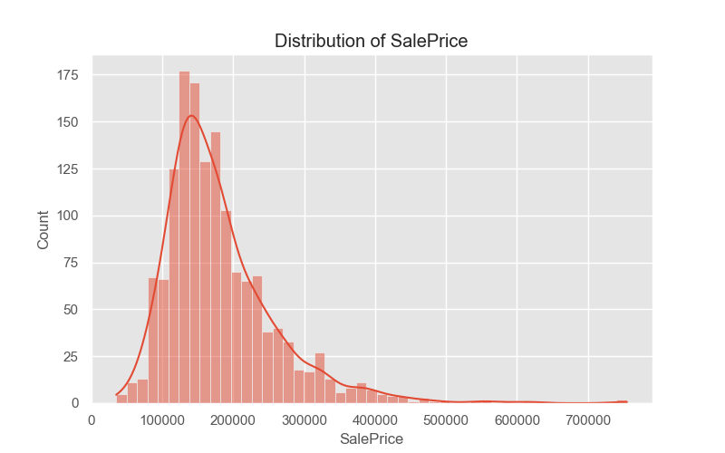
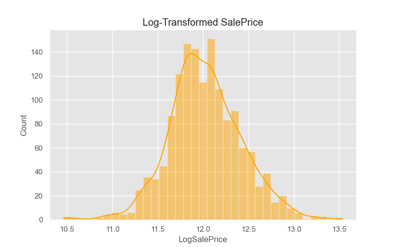
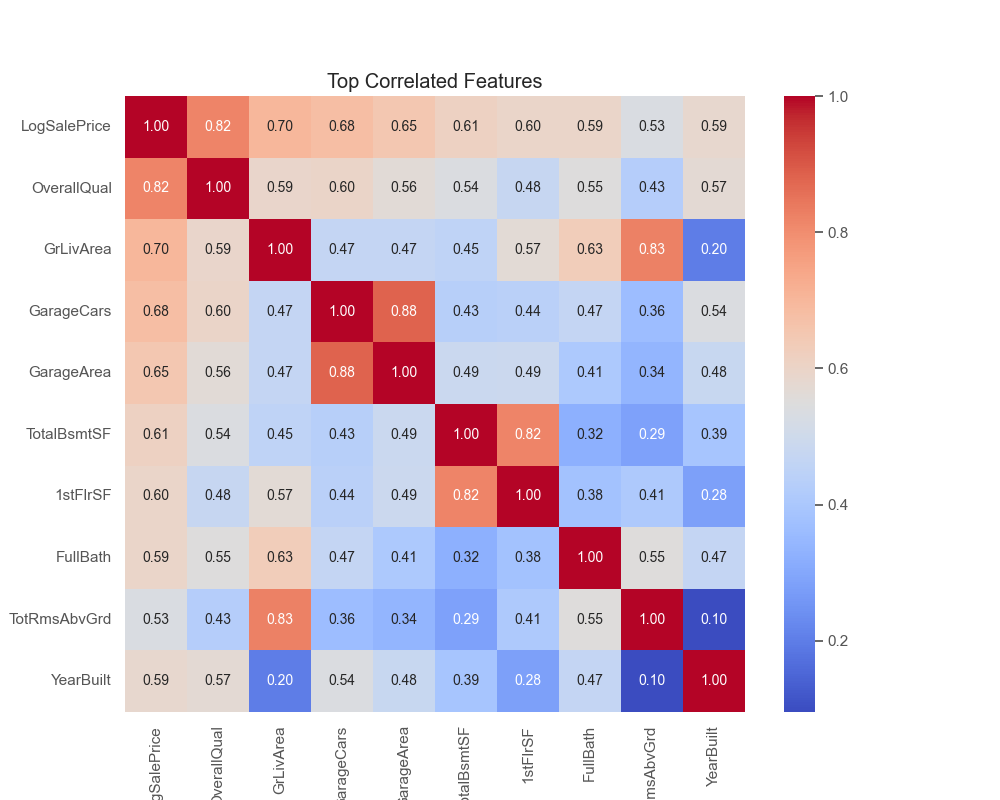
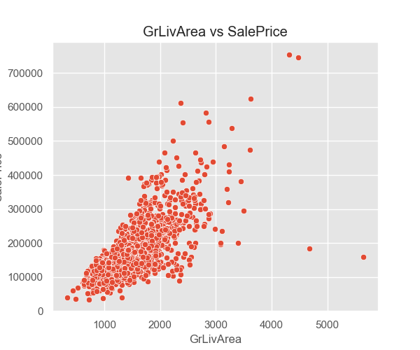
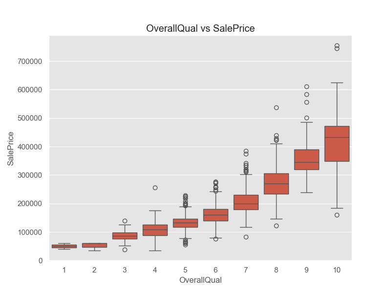
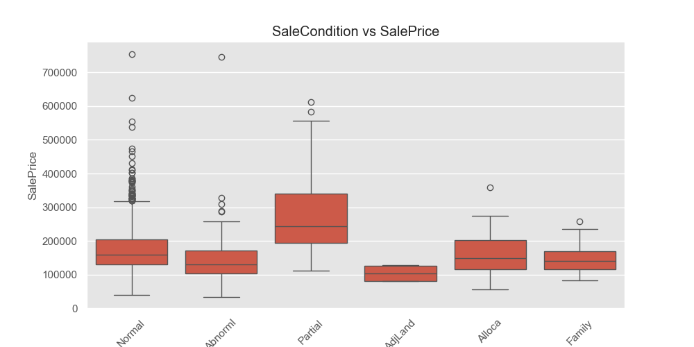

# 🏠 House Price Prediction - Exploratory Data Analysis (EDA)

This project focuses on performing **Exploratory Data Analysis (EDA)** on the **House Prices: Advanced Regression Techniques** dataset from [Kaggle](https://www.kaggle.com/competitions/house-prices-advanced-regression-techniques). 

The main goal is to explore the data, uncover patterns, and understand which features are most strongly related to house sale prices. This is a foundational step before building predictive models.

---

## 📊 EDA Overview

The EDA covers the following key areas:

- **Loading and inspecting the dataset**
  - Data types, missing values, and descriptive statistics.
  
- **Target variable analysis (`SalePrice`)**
  - Distribution plot (original and log-transformed).
  
- **Correlation analysis**
  - Find numerical features most correlated with `SalePrice`.
  - Generate a heatmap of top correlated features.

- **Feature visualizations**
  - Scatter plot: `GrLivArea` vs `SalePrice`
  - Box plots: `OverallQual` and `SaleCondition` vs `SalePrice`

---

## 📊 Sample Visuals

**SalePrice Distribution (Original & Log Transformed)**  
  


**Top Correlated Features Heatmap**  


**Feature Relationships**  
`GrLivArea` vs `SalePrice`  


`OverallQual` vs `SalePrice`  


`SaleCondition` vs `SalePrice`  


---

## 🧰 Technologies Used

- **Python 3**
- **Pandas** - Data manipulation
- **NumPy** - Numerical operations
- **Seaborn** - Statistical visualizations
- **Matplotlib** - Plotting

---

## 🚀 How to Run

> Make sure the `train.csv` file is located in the `data/` directory.

```bash
# Navigate to code directory
cd code/

# Run the EDA script
python edaHousePrice.py

