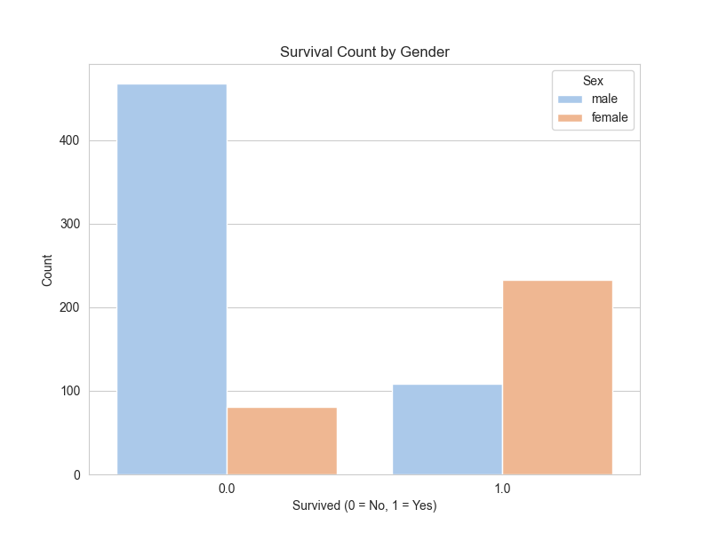
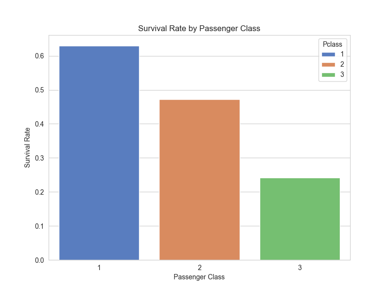
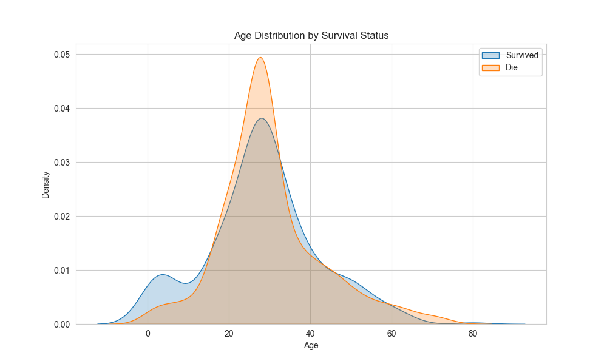

# 🛳️ Titanic Survivors - Exploratory Data Analysis (EDA)

This project presents an in-depth exploratory data analysis (EDA) of the Titanic dataset, which contains information about passengers aboard the Titanic. The goal is to uncover patterns and insights that explain survival rates and identify key features that influenced the outcome.

## 📌 Project Objectives

- Perform data cleaning and preprocessing
- Conduct univariate and multivariate analysis
- Visualize patterns in survival with respect to features such as age, gender, class, etc.
- Draw conclusions and insights from the data
- Provide a solid foundation for future predictive modeling

---

## 📂 Dataset

The dataset is the **Titanic** dataset from [Kaggle](https://www.kaggle.com/competitions/titanic/data), containing:
- PassengerId
- Survived (target)
- Pclass
- Name
- Sex
- Age
- SibSp
- Parch
- Ticket
- Fare
- Cabin
- Embarked

---

## 🔧 Technologies Used

- **Python 3**
- **Pandas** for data manipulation
- **NumPy** for numerical operations
- **Matplotlib** & **Seaborn** for data visualization

---

## 📊 Key Insights

- **Gender** was a strong predictor of survival: females had significantly higher survival rates.
- **Passenger class (Pclass)** affected survival: 1st class passengers were more likely to survive.
- **Age** played a role: children had higher survival rates.
- Missing values in **Age** and **Cabin** needed to be addressed for a complete analysis.
- **Embarked** location also showed differences in survival probability.

---

## 📊 Key Insights

- Females had significantly higher survival rates than males.
- First-class passengers were more likely to survive.
- Children had a better chance of survival.
- Missing values in Age and Cabin required preprocessing.

---

## 🖼️ Sample Visualizations

### Survival by Gender

### Survival Rate by Class

### Age Distribution of Survivors vs Non-Survivors

